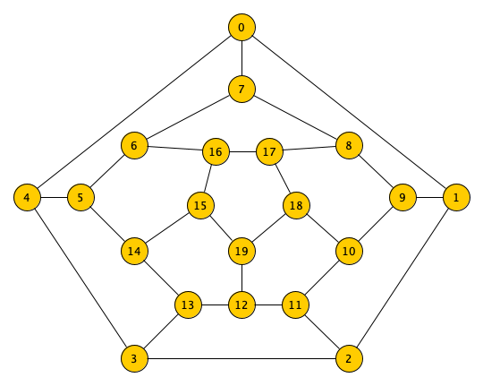

# Hunt the Wumpus

_Hunt the Wumpus_ is a text-based adventure game. The player hunts the wumpus in
a cave. In addition to this, there are other dangers: bottomless pits and super
bats. The only weapon the player has is a bow with 5 crooked arrows.

## Stories

### Start Game

-   Optional show instructions at first start.
-   Create cave with 20 rooms each with 3 tunnels leading to other rooms
    (dodecahedron).
-   Place items without crossovers:
    -   1 room with the wumpus
    -   1 room with the player
    -   2 rooms have bottomless pits
    -   2 rooms have super bats
-   When game over than reset last game setup or create a new setup.

### Loop the Game

-   Determine hazard warnings.
-   Determine current room and tunnels lead to other rooms.
-   Ask player to move or shoot.
-   Decide if game is open, won or lost.

### Move to Room

-   Go to next room through a tunnel.
-   If you enter wumpus' room, he wakes up and moves one room (P=0.75) or stays
    still (P=0.25) and eats you up (you lose).
-   If you enter a room with bottemless pit, you fall into the pit and lose.
-   If you enter a room with a super bat, it grabs you and takes you to some
    other room (which might be troblesome).

### Shoot a crooked Arrow

-   Fire arrow through 1 to 5 rooms.
-   If a given room does not exist, the arrow move random.
-   If the arrow hits the wumpus, you win.
-   If the arrow hits you, you lose.
-   If the arrow miss, the wumpus wake up (see above).

## Dodecahedron

