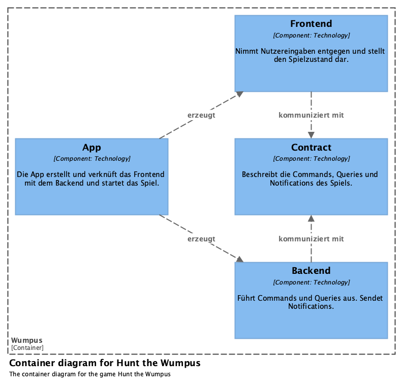

= Hunt the Wumpus

== User Stories

=== Starte Spiel

* Die Höhle des Wumpus besteht aus 20 Räumen mit je 3 Tunneln zu einem anderen Raum (vergleiche Dodekaeder)
* Platziere in 2 zufälligen Räumen je eine bodenlose Grube
* Platziere in 2 zufälligen Räumen je eine Superfledermaus
* Platziere in zufälligen den Wumpus
* Platziere in zufälligen den Spieler
* Grube, Fledermaus, Wumpus oder Spieler dürfen sich zu Spielbeginn keinen Raum teilen

=== Erkunde Raum

* Nenne den Raum, in dem sich der Spieler befindet
* Liste die angrenzenden Räume auf
* Wenn sich der Wumpus in einem der angrenzenden Räume befindet, warne den Spieler
* Wenn sich eine Grube in einem der angrenzenden Räume befindet, warne den Spieler
* Wenn sich eine Fledermaus in einem der angrenzenden Räume befindet, warne den Spieler

=== Gehe in nächsten Raum

* Frage Spieler nach den angrenzenden Raum, in den er sich bewegen will
* Wenn der Spieler einen Raum mit einer Grube betritt, fällt er hinein und hat verloren
* Wenn der Spieler einen Raum mit einer Fledermaus betritt, wird er in einen zufälligen anderen Raum versetzt, in dem es weitere Gefahren geben kann
* Wenn der Spieler den Raum mit dem Wumpus betritt, bewegt sich der Wumpus einen Raum weiter (P=0,75) oder bleibt stehen (P=0,25)
* Wenn sich der Spieler und der Wumpus anschließend im selben Raum befinden, wird der Spieler gefressen und hat verloren

=== Schieße krummen Pfeil

* Frage Spieler nach Anzahl der Räume, die der Pfeil durchqueren soll (1-5)
* Frage nach den Räumen, die der Pfeil durchqueren soll
* Der nächste zu durchquerende Raum muss sich vom vorletzten unterscheiden (p(i) <> p(i-2))
* Wenn zum angegebener Raum kein Tunnel führt, nimmt der krumme Pfeil einen zufälligen Tunnel
* Wenn der Pfeil den Wumpus trifft, hat der Spieler gewonnen
* Wenn der Pfeil den Spieler trifft, hat der Spieler verloren
* Wenn der Pfeil den Wumpus nicht trifft, bewegt sich der Wumpus einen Raum weiter (P=0,75) oder bleibt stehen (P=0,25)
* Wenn sich der Spieler und der Wumpus anschließend im selben Raum befinden, wird der Spieler gefressen und hat verloren
* Wenn der Spieler seine 5 Pfeile ohne zu treffen verschossen hat, hat er verloren

=== Bestimme Spielzustand

* Das Spiel kann offen, gewonnen oder verloren sein

== Architektur

1. Die App wird als Single-File Source-Code entwickelt, damit sie einfach weitergegeben und ausgeführt werden kann.
